# ERD AI Support And Observability

## Scope
- Dokumen ini menyelesaikan task `ARCH-11`.
- Fokus ERD dibatasi ke kebutuhan minimum AI support dan observability untuk MVP, dengan tabel utama `ai_request_logs`.
- Dokumen ini menambahkan supporting table `ai_request_attempts` agar retry, failure, dan metrik provider bisa dicatat rapi tanpa memadatkan semua detail ke satu row.
- Relasi ke `users`, `practice_sessions`, `practice_answers`, dan flow personalization diperlakukan sebagai external references dari ERD lain; log AI tetap dibuat generic agar reusable lintas use case.

## Design Goals
- Menyediakan log observability minimum yang sudah dikunci di MVP plan: `request_id`, `provider`, `model`, `latency`, `token usage`, `estimated cost`, `schema_parse_success`, `retry_count`, dan `failure_reason`.
- Tetap provider-agnostic agar adapter default OpenAI sekarang tidak mengunci schema bila nanti provider diganti.
- Mendukung use case AI yang sudah ada di scope MVP: practice question generation, free-response grading, personalization note normalization, dan recommendation generation.
- Menjaga payload sensitif tetap bisa disimpan dalam bentuk redacted/sanitized, bukan raw dump tanpa kontrol.

## Entity Relationship Diagram

```mermaid
erDiagram
    USERS ||--o{ AI_REQUEST_LOGS : triggers
    AI_REQUEST_LOGS ||--o{ AI_REQUEST_ATTEMPTS : retries

    USERS {
        char(36) id PK
    }

    AI_REQUEST_LOGS {
        char(36) id PK
        varchar(100) request_key UK
        char(36) user_id FK
        varchar(50) source_module
        varchar(100) operation_name
        varchar(50) source_entity_type
        char(36) source_entity_id
        varchar(50) provider
        varchar(100) model
        varchar(50) request_status
        varchar(100) schema_name
        boolean schema_parse_success
        int retry_count
        int total_latency_ms
        int prompt_tokens
        int completion_tokens
        int total_tokens
        decimal estimated_cost_usd
        varchar(100) failure_code
        text failure_reason
        json redacted_input_payload
        json redacted_output_payload
        json metadata
        timestamp started_at
        timestamp completed_at
        timestamp created_at
        timestamp updated_at
    }

    AI_REQUEST_ATTEMPTS {
        char(36) id PK
        char(36) ai_request_log_id FK
        int attempt_number
        varchar(50) provider
        varchar(100) model
        varchar(100) provider_request_id
        varchar(50) attempt_status
        int latency_ms
        int prompt_tokens
        int completion_tokens
        int total_tokens
        decimal estimated_cost_usd
        boolean schema_parse_success
        varchar(100) failure_code
        text failure_reason
        json redacted_input_payload
        json redacted_output_payload
        json attempt_metadata
        timestamp started_at
        timestamp completed_at
        timestamp created_at
        timestamp updated_at
    }
```

## Relationship Notes
- `users 1 -> N ai_request_logs`: satu user bisa memicu banyak request AI dari berbagai flow belajar.
- `ai_request_logs 1 -> N ai_request_attempts`: satu logical request bisa memiliki beberapa attempt bila terjadi retry, provider error, schema parse failure, atau fallback model.
- `ai_request_logs` menyimpan ringkasan final per request, sementara `ai_request_attempts` menyimpan detail granular per percobaan.

## Table Definitions

### `ai_request_logs`
Log utama level request untuk kebutuhan audit, budget guardrail, dan observability lintas module.

| Column | Type | Constraint | Notes |
| --- | --- | --- | --- |
| `id` | `char(36)` | PK | Internal log id. |
| `request_key` | `varchar(100)` | UK, not null | Correlation id internal untuk satu logical AI request. |
| `user_id` | `char(36)` | FK -> `users.id`, null | Nullable untuk request sistem/offline job; terisi untuk flow user-facing. |
| `source_module` | `varchar(50)` | not null | Mis. `practice`, `personalization`, `shared_ai`. |
| `operation_name` | `varchar(100)` | not null | Mis. `generate_practice_session`, `grade_practice_answer`, `summarize_placement`, `generate_study_recommendation`. |
| `source_entity_type` | `varchar(50)` | null | Tipe entity yang memicu request, mis. `practice_session`, `practice_answer`, `personalization_assessment`. |
| `source_entity_id` | `char(36)` | null | Identifier entity pemicu dari module asal. |
| `provider` | `varchar(50)` | not null | Provider final yang dipakai, mis. `openai`. |
| `model` | `varchar(100)` | not null | Model final, mis. `gpt-5-mini`. |
| `request_status` | `varchar(50)` | not null | Mis. `succeeded`, `failed`, `partial`, `cancelled`. |
| `schema_name` | `varchar(100)` | null | Nama schema output yang diharapkan. |
| `schema_parse_success` | `boolean` | not null default `false` | Status parse final setelah seluruh retry selesai. |
| `retry_count` | `int` | not null default `0` | Jumlah retry setelah attempt pertama. |
| `total_latency_ms` | `int` | null | Latency total logical request lintas retry. |
| `prompt_tokens` | `int` | null | Total prompt/input tokens final yang ditagih. |
| `completion_tokens` | `int` | null | Total completion/output tokens final yang ditagih. |
| `total_tokens` | `int` | null | Ringkasan total token usage. |
| `estimated_cost_usd` | `decimal(12,6)` | null | Estimasi biaya request. |
| `failure_code` | `varchar(100)` | null | Kode error ringkas untuk grouping/reporting. |
| `failure_reason` | `text` | null | Penjelasan error final paling relevan. |
| `redacted_input_payload` | `json` | null | Input teredaksi agar observability tetap aman. |
| `redacted_output_payload` | `json` | null | Output teredaksi atau potongan terstruktur yang aman disimpan. |
| `metadata` | `json` | null | Field tambahan untuk trace, environment, temperature, atau feature flags. |
| `started_at` | `timestamp` | not null | Waktu request logical dimulai. |
| `completed_at` | `timestamp` | null | Waktu request logical selesai. |
| `created_at` | `timestamp` | not null | Audit create time. |
| `updated_at` | `timestamp` | not null | Audit update time. |

Recommended constraints:
- unique index `ai_request_logs_request_key_uk` pada `request_key`
- index `ai_request_logs_user_started_idx` pada `user_id, started_at`
- index `ai_request_logs_source_idx` pada `source_module, operation_name, started_at`
- index `ai_request_logs_status_idx` pada `request_status, started_at`

### `ai_request_attempts`
Detail setiap percobaan request ke provider, termasuk retry dan fallback model.

| Column | Type | Constraint | Notes |
| --- | --- | --- | --- |
| `id` | `char(36)` | PK | Internal attempt id. |
| `ai_request_log_id` | `char(36)` | FK -> `ai_request_logs.id`, not null | Parent logical request. |
| `attempt_number` | `int` | not null | Urutan attempt, dimulai dari `1`. |
| `provider` | `varchar(50)` | not null | Provider yang dipakai attempt ini. |
| `model` | `varchar(100)` | not null | Model yang dipakai attempt ini. |
| `provider_request_id` | `varchar(100)` | null | Request id dari provider bila tersedia. |
| `attempt_status` | `varchar(50)` | not null | Mis. `succeeded`, `failed`, `timeout`, `parse_failed`. |
| `latency_ms` | `int` | null | Latency satu attempt. |
| `prompt_tokens` | `int` | null | Token input per attempt. |
| `completion_tokens` | `int` | null | Token output per attempt. |
| `total_tokens` | `int` | null | Total token per attempt. |
| `estimated_cost_usd` | `decimal(12,6)` | null | Estimasi biaya per attempt. |
| `schema_parse_success` | `boolean` | not null default `false` | Membantu membedakan request provider sukses tetapi output schema gagal diparse. |
| `failure_code` | `varchar(100)` | null | Kode error attempt-level. |
| `failure_reason` | `text` | null | Detail error attempt-level. |
| `redacted_input_payload` | `json` | null | Snapshot input teredaksi untuk attempt ini. |
| `redacted_output_payload` | `json` | null | Snapshot output teredaksi untuk attempt ini. |
| `attempt_metadata` | `json` | null | Mis. temperature, reasoning mode, fallback trigger, atau retry cause. |
| `started_at` | `timestamp` | not null | Waktu attempt dimulai. |
| `completed_at` | `timestamp` | null | Waktu attempt selesai. |
| `created_at` | `timestamp` | not null | Audit create time. |
| `updated_at` | `timestamp` | not null | Audit update time. |

Recommended constraints:
- unique composite `(`ai_request_log_id`, `attempt_number`)`
- index `ai_request_attempts_provider_model_idx` pada `provider, model, started_at`
- index `ai_request_attempts_status_idx` pada `attempt_status, started_at`

## Ownership And Flow Mapping
- Tabel ini paling aman diperlakukan sebagai shared observability sink di lapisan AI abstraction, bukan dimiliki penuh oleh `practice` atau `personalization`.
- `practice` menulis log saat generate question set atau grade free-response melalui provider.
- `personalization` menulis log saat menormalisasi free-text onboarding note atau saat nanti menghasilkan recommendation berbasis AI.
- `ai_request_logs` menjadi query source utama untuk monitoring cost, error rate, dan schema-parse health.
- `ai_request_attempts` dipakai saat butuh investigasi retry, fallback model, timeout, atau provider-specific issue.

## Constraints And Assumptions
- Task `ARCH-11` meminta observability minimum; karena itu model ini sengaja fokus pada request log dan attempt detail, bukan membangun full audit warehouse.
- `source_entity_type` dan `source_entity_id` dibuat generic agar satu schema bisa dipakai lintas flow tanpa FK polymorphic yang rumit.
- Payload disimpan dalam bentuk `redacted_*` agar schema ini aman dipakai di production tanpa menjadi tempat penyimpanan data mentah yang sensitif secara berlebihan.
- Walau tabel mendukung banyak provider, MVP tetap diasumsikan memakai adapter default OpenAI terlebih dulu.
- Jika nanti tim memutuskan observability AI disalurkan penuh ke external log sink, tabel ini masih berguna sebagai transactional trace minimum untuk debugging aplikasi dan rekonsiliasi biaya.

## Out Of Scope For This ERD
- Prompt template registry, versioned prompt library, atau evaluation dataset untuk quality benchmarking.
- Materialized analytics table untuk dashboard BI atau cost aggregation harian.
- Full raw transcript storage dari semua prompt dan response tanpa redaction.
