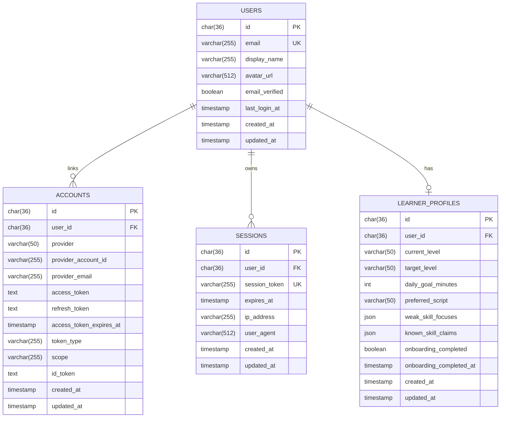

# ERD Auth And User Profile

## Scope
- Dokumen ini menyelesaikan task `ARCH-08`.
- Fokus ERD dibatasi ke empat entitas inti MVP: `users`, `accounts`, `sessions`, dan `learner_profiles`.
- Model ini diturunkan dari sequence diagram login Google, onboarding personalization, dan AI normalization confirmation flow.

## Design Goals
- Pisahkan ownership data dengan jelas antara context `auth` dan `users`.
- Pastikan login Google first-time bisa mem-provision `users` lebih dulu sebelum `accounts` dan `sessions` dibuat.
- Pastikan hasil onboarding personalization tersimpan sebagai state final yang dimiliki `users`, bukan oleh `auth` atau `personalization`.

## Entity Relationship Diagram

## Relationship Notes
- `users 1 -> N accounts`: satu user bisa punya lebih dari satu linked auth account di masa depan, walau MVP saat ini baru memakai Google.
- `users 1 -> N sessions`: satu user bisa login dari beberapa device/browser sekaligus.
- `users 1 -> 0..1 learner_profiles`: learner profile boleh belum ada saat user baru selesai login pertama kali tetapi belum onboarding.

## Table Definitions

### `users`
Source of truth untuk identitas internal user.

| Column | Type | Constraint | Notes |
| --- | --- | --- | --- |
| `id` | `char(36)` | PK | Internal user id. UUID disarankan agar aman dipakai lintas module. |
| `email` | `varchar(255)` | UK, not null | Email utama user; dipakai untuk identitas kontak dan dedup provisioning. |
| `display_name` | `varchar(255)` | not null | Nama tampilan dari provider atau hasil normalisasi internal. |
| `avatar_url` | `varchar(512)` | null | URL avatar dari provider. |
| `email_verified` | `boolean` | not null default `false` | Menandai status verifikasi email dari provider/auth layer. |
| `last_login_at` | `timestamp` | null | Waktu login terakhir yang berhasil. |
| `created_at` | `timestamp` | not null | Audit create time. |
| `updated_at` | `timestamp` | not null | Audit update time. |

### `accounts`
Tabel linkage antara user internal dan provider OAuth.

| Column | Type | Constraint | Notes |
| --- | --- | --- | --- |
| `id` | `char(36)` | PK | Internal account-link id. |
| `user_id` | `char(36)` | FK -> `users.id`, not null | Owner account. |
| `provider` | `varchar(50)` | not null | Contoh awal: `GOOGLE`. |
| `provider_account_id` | `varchar(255)` | not null | Subject/account id dari provider. |
| `provider_email` | `varchar(255)` | null | Salinan email provider untuk audit/debug auth. |
| `access_token` | `text` | null | Opsional, tergantung kebutuhan adapter/provider. |
| `refresh_token` | `text` | null | Opsional untuk refresh token flow. |
| `access_token_expires_at` | `timestamp` | null | Expiry token provider bila disimpan. |
| `token_type` | `varchar(255)` | null | Metadata token provider. |
| `scope` | `varchar(255)` | null | Scope OAuth yang diberikan user. |
| `id_token` | `text` | null | Raw ID token bila perlu disimpan adapter. |
| `created_at` | `timestamp` | not null | Audit create time. |
| `updated_at` | `timestamp` | not null | Audit update time. |

Recommended constraints:
- unique composite `(`provider`, `provider_account_id`)`
- index `accounts_user_id_idx` pada `user_id`

### `sessions`
Session aktif aplikasi setelah proses auth berhasil.

| Column | Type | Constraint | Notes |
| --- | --- | --- | --- |
| `id` | `char(36)` | PK | Internal session id. |
| `user_id` | `char(36)` | FK -> `users.id`, not null | Owner session. |
| `session_token` | `varchar(255)` | UK, not null | Token session yang dipakai adapter auth/cookie lookup. |
| `expires_at` | `timestamp` | not null | Batas masa berlaku session. |
| `ip_address` | `varchar(255)` | null | Observability ringan untuk session metadata. |
| `user_agent` | `varchar(512)` | null | Metadata device/browser ringan. |
| `created_at` | `timestamp` | not null | Audit create time. |
| `updated_at` | `timestamp` | not null | Audit update time. |

Recommended constraints:
- index `sessions_user_id_idx` pada `user_id`
- index `sessions_expires_at_idx` pada `expires_at`

### `learner_profiles`
State profile belajar final milik context `users`, diisi setelah onboarding dikonfirmasi user.

| Column | Type | Constraint | Notes |
| --- | --- | --- | --- |
| `id` | `char(36)` | PK | Internal learner profile id. |
| `user_id` | `char(36)` | FK -> `users.id`, UK, not null | Menjamin satu user maksimal punya satu learner profile aktif. |
| `current_level` | `varchar(50)` | null | Level awal yang dirasa user, mis. `BEGINNER`, `JLPT_N5`. |
| `target_level` | `varchar(50)` | not null | Target utama learner. |
| `daily_goal_minutes` | `int` | not null | Target belajar harian dalam menit. |
| `preferred_script` | `varchar(50)` | not null | Preferensi script utama, mis. `ROMAJI`, `KANA`, `MIXED`. |
| `weak_skill_focuses` | `json` | not null | Daftar weak area/skill focus yang dipilih user atau hasil konfirmasi. |
| `known_skill_claims` | `json` | not null | Klaim skill yang sudah dikuasai hasil structured form + AI draft yang sudah dikonfirmasi. |
| `onboarding_completed` | `boolean` | not null default `false` | Gate utama untuk akses route app setelah onboarding. |
| `onboarding_completed_at` | `timestamp` | null | Waktu final konfirmasi onboarding. |
| `created_at` | `timestamp` | not null | Audit create time. |
| `updated_at` | `timestamp` | not null | Audit update time. |

## Ownership And Flow Mapping
- `auth` memiliki lifecycle `accounts` dan `sessions`.
- `users` memiliki `users` dan `learner_profiles`.
- Pada first-time login, urutan persistence adalah `users` lalu `accounts` lalu `sessions`.
- Pada onboarding, `personalization` menghitung draft profile, tetapi write final tetap masuk ke `learner_profiles` melalui use case di `users`.
- `onboarding_completed` disimpan di `learner_profiles`, bukan di `sessions`, supaya statusnya stabil lintas device dan lintas login.

## Constraints And Assumptions
- OAuth provider MVP hanya Google, tetapi schema `accounts` dibuat multi-provider sejak awal agar tidak perlu migrasi konseptual besar nanti.
- Session metadata seperti `ip_address` dan `user_agent` bersifat opsional, tetapi berguna untuk audit ringan dan device management dasar.
- `weak_skill_focuses` dan `known_skill_claims` tetap `json` pada MVP agar onboarding bisa bergerak cepat sebelum katalog skill final dari task `ARCH-09` dikunci.
- Relasi ke katalog syllabus detail belum ditambahkan di dokumen ini; normalisasi ke foreign key skill bisa dipertimbangkan lagi setelah ERD syllabus selesai.

## Out Of Scope For This ERD
- Tabel assessment draft atau log AI normalization. Itu masuk area `ARCH-11` bila nanti diputuskan perlu tabel observability/personalization log.
- Settings non-onboarding seperti language preference, notification preference, atau billing.
- Domain progress, flashcard, practice, dan syllabus yang akan dibahas di task ERD berikutnya.
