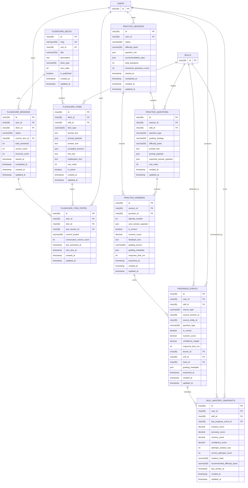

# ERD Learning Activity

## Scope
- Dokumen ini menyelesaikan task `ARCH-10`.
- Fokus utamanya mencakup tabel inti yang diminta oleh task: `flashcard_decks`, `flashcard_items`, `practice_sessions`, `practice_questions`, `practice_answers`, `progress_events`, dan `skill_mastery_snapshots`.
- Dokumen ini juga menambahkan dua supporting entity, `flashcard_sessions` dan `flashcard_item_states`, karena sequence diagram `POST /flashcards/sessions/:id/answer` dan rule Leitner bucket tidak bisa dimodelkan dengan aman tanpa state per session dan state per user-per-item.
- Relasi ke `users` dan `skills` diperlakukan sebagai external references dari ERD `ARCH-08` dan `ARCH-09`.

## Design Goals
- Menjaga ownership data tetap sesuai boundary module: `flashcards` dan `practice` menyimpan hasil internalnya sendiri lebih dulu, lalu `progress` menerima handoff event terstruktur.
- Menyediakan model persistence yang cukup untuk deterministic flashcard grading, AI-assisted practice grading, dan recompute mastery snapshot secara write-through.
- Menjaga atribusi `user -> skill -> learning event -> mastery snapshot` tetap stabil untuk dashboard, recommendation, dan future analytics.

## Entity Relationship Diagram

## Relationship Notes
- `flashcard_decks 1 -> N flashcard_items`: satu deck berisi kumpulan item deterministik yang bisa diulang berkali-kali.
- `flashcard_decks 1 -> N flashcard_sessions`: satu user bisa membuka banyak session untuk deck yang sama di waktu berbeda.
- `flashcard_items 1 -> N flashcard_item_states`: state Leitner disimpan per `user + item`, bukan di tabel item global.
- `practice_sessions 1 -> N practice_questions`: satu session practice menghasilkan satu set pertanyaan.
- `practice_questions 1 -> N practice_answers`: MVP bisa memakai satu answer per question, tetapi relasi dibuat `1 -> N` agar retry/future replay tidak mematahkan schema.
- `practice_answers 1 -> N progress_events`: satu jawaban practice minimal menghasilkan satu event, tetapi model ini tetap aman bila nanti ada pemecahan event granular.
- `users 1 -> N progress_events` dan `users 1 -> N skill_mastery_snapshots`: progress selalu dihitung per user.
- `skills 1 -> N progress_events` dan `skills 1 -> N skill_mastery_snapshots`: skill adalah level terkecil yang diatribusikan dan diringkas oleh domain `progress`.

## Table Definitions

### `flashcard_decks`
Katalog deck flashcard yang dibaca user sebelum memulai session.

| Column | Type | Constraint | Notes |
| --- | --- | --- | --- |
| `id` | `char(36)` | PK | Internal deck id. |
| `slug` | `varchar(100)` | UK, not null | Identifier stabil untuk list/detail API. |
| `unit_id` | `char(36)` | FK -> `units.id`, null | Scope utama deck ke unit syllabus; nullable untuk deck campuran. |
| `title` | `varchar(255)` | not null | Nama deck. |
| `description` | `text` | null | Ringkasan isi deck. |
| `deck_type` | `varchar(50)` | not null | Mis. `review`, `foundation`, `weak-skill`. |
| `sort_order` | `int` | not null | Urutan deck di list UI. |
| `is_published` | `boolean` | not null default `false` | Gate visibility deck. |
| `created_at` | `timestamp` | not null | Audit create time. |
| `updated_at` | `timestamp` | not null | Audit update time. |

Recommended constraints:
- unique index `flashcard_decks_slug_uk` pada `slug`
- unique composite `(`unit_id`, `sort_order`)` bila deck memang diurutkan per unit

### `flashcard_items`
Item konten flashcard yang menjadi basis evaluasi deterministik.

| Column | Type | Constraint | Notes |
| --- | --- | --- | --- |
| `id` | `char(36)` | PK | Internal flashcard item id. |
| `deck_id` | `char(36)` | FK -> `flashcard_decks.id`, not null | Parent deck. |
| `skill_id` | `char(36)` | FK -> `skills.id`, not null | Skill utama yang diukur item ini. |
| `item_type` | `varchar(50)` | not null | Mis. `kana_to_sound`, `vocab_recall`, `meaning_match`. |
| `prompt_text` | `text` | not null | Prompt utama yang dirender. |
| `prompt_payload` | `json` | null | Struktur tambahan untuk UI jika prompt butuh metadata. |
| `answer_text` | `text` | not null | Jawaban canonical. |
| `accepted_answers` | `json` | null | Variasi jawaban yang tetap dianggap benar. |
| `hint_text` | `text` | null | Hint ringan opsional. |
| `explanation_text` | `text` | null | Penjelasan feedback singkat. |
| `sort_order` | `int` | not null | Urutan item di deck. |
| `is_active` | `boolean` | not null default `true` | Menandai item masih dipakai sistem. |
| `created_at` | `timestamp` | not null | Audit create time. |
| `updated_at` | `timestamp` | not null | Audit update time. |

Recommended constraints:
- unique composite `(`deck_id`, `sort_order`)`
- index `flashcard_items_skill_id_idx` pada `skill_id`

### `flashcard_sessions`
Representasi satu run user ketika mengerjakan deck flashcard.

| Column | Type | Constraint | Notes |
| --- | --- | --- | --- |
| `id` | `char(36)` | PK | Internal session id. |
| `user_id` | `char(36)` | FK -> `users.id`, not null | Owner session. |
| `deck_id` | `char(36)` | FK -> `flashcard_decks.id`, not null | Deck yang dikerjakan. |
| `status` | `varchar(50)` | not null | Mis. `active`, `completed`, `abandoned`. |
| `current_item_id` | `char(36)` | FK -> `flashcard_items.id`, null | Pointer item yang sedang/terakhir dikerjakan. |
| `total_answered` | `int` | not null default `0` | Total jawaban dalam session ini. |
| `correct_count` | `int` | not null default `0` | Counter jawaban benar. |
| `incorrect_count` | `int` | not null default `0` | Counter jawaban salah. |
| `started_at` | `timestamp` | not null | Waktu session dimulai. |
| `completed_at` | `timestamp` | null | Waktu session selesai. |
| `created_at` | `timestamp` | not null | Audit create time. |
| `updated_at` | `timestamp` | not null | Audit update time. |

Recommended constraints:
- index `flashcard_sessions_user_status_idx` pada `user_id, status`
- index `flashcard_sessions_deck_id_idx` pada `deck_id`

### `flashcard_item_states`
State Leitner bucket per user-per-item yang dimiliki module `flashcards`.

| Column | Type | Constraint | Notes |
| --- | --- | --- | --- |
| `id` | `char(36)` | PK | Internal item-state id. |
| `user_id` | `char(36)` | FK -> `users.id`, not null | Owner state. |
| `item_id` | `char(36)` | FK -> `flashcard_items.id`, not null | Item yang di-track. |
| `last_session_id` | `char(36)` | FK -> `flashcard_sessions.id`, null | Session terakhir yang mengubah bucket ini. |
| `current_bucket` | `varchar(50)` | not null | Bucket Leitner MVP: `new`, `learning`, `mastered`. |
| `consecutive_correct_count` | `int` | not null default `0` | Membantu rule promote/demote ringan. |
| `last_answered_at` | `timestamp` | null | Waktu jawaban terakhir untuk item ini. |
| `next_due_at` | `timestamp` | null | Kapan item berikutnya layak dimunculkan lagi. |
| `created_at` | `timestamp` | not null | Audit create time. |
| `updated_at` | `timestamp` | not null | Audit update time. |

Recommended constraints:
- unique composite `(`user_id`, `item_id`)`
- index `flashcard_item_states_user_due_idx` pada `user_id, next_due_at`

### `practice_sessions`
Representasi satu sesi random question generation untuk satu user.

| Column | Type | Constraint | Notes |
| --- | --- | --- | --- |
| `id` | `char(36)` | PK | Internal practice session id. |
| `user_id` | `char(36)` | FK -> `users.id`, not null | Owner session. |
| `status` | `varchar(50)` | not null | Mis. `generated`, `in_progress`, `completed`, `expired`. |
| `difficulty_band` | `varchar(50)` | not null | Difficulty output dari personalization/practice orchestration. |
| `question_mix` | `json` | not null | Komposisi seperti `weak`, `reinforcement`, `stretch`. |
| `recommendation_spec` | `json` | not null | Snapshot input rekomendasi saat session dibuat. |
| `total_questions` | `int` | not null | Default MVP: `5`. |
| `answered_questions_count` | `int` | not null default `0` | Counter progress session. |
| `started_at` | `timestamp` | not null | Waktu session dimulai/digenerate. |
| `completed_at` | `timestamp` | null | Waktu session selesai. |
| `created_at` | `timestamp` | not null | Audit create time. |
| `updated_at` | `timestamp` | not null | Audit update time. |

Recommended constraints:
- index `practice_sessions_user_status_idx` pada `user_id, status`
- index `practice_sessions_started_at_idx` pada `started_at`

### `practice_questions`
Kumpulan soal yang tergenerate di dalam satu practice session.

| Column | Type | Constraint | Notes |
| --- | --- | --- | --- |
| `id` | `char(36)` | PK | Internal question id. |
| `session_id` | `char(36)` | FK -> `practice_sessions.id`, not null | Parent session. |
| `skill_id` | `char(36)` | FK -> `skills.id`, not null | Skill utama yang diukur question ini. |
| `question_type` | `varchar(50)` | not null | Mis. `multiple_choice`, `slot_fill`, `short_free_response`. |
| `grading_strategy` | `varchar(50)` | not null | Mis. `deterministic`, `ai`. |
| `difficulty_band` | `varchar(50)` | not null | Difficulty per-question setelah generation final. |
| `prompt_text` | `text` | not null | Prompt utama yang dirender ke UI. |
| `prompt_payload` | `json` | null | Payload terstruktur untuk opsi, stimulus, atau media. |
| `expected_answer_payload` | `json` | null | Kunci jawaban atau grading rubric minimum. |
| `sort_order` | `int` | not null | Urutan soal di dalam session. |
| `created_at` | `timestamp` | not null | Audit create time. |
| `updated_at` | `timestamp` | not null | Audit update time. |

Recommended constraints:
- unique composite `(`session_id`, `sort_order`)`
- index `practice_questions_skill_id_idx` pada `skill_id`

### `practice_answers`
Jawaban user terhadap question di `practice`, termasuk hasil grading dan feedback.

| Column | Type | Constraint | Notes |
| --- | --- | --- | --- |
| `id` | `char(36)` | PK | Internal practice answer id. |
| `session_id` | `char(36)` | FK -> `practice_sessions.id`, not null | Denormalisasi ringan untuk query session summary. |
| `question_id` | `char(36)` | FK -> `practice_questions.id`, not null | Question yang dijawab. |
| `attempt_number` | `int` | not null default `1` | Aman untuk future retry tanpa ubah schema. |
| `user_answer_payload` | `json` | not null | Jawaban mentah user, baik teks maupun pilihan terstruktur. |
| `is_correct` | `boolean` | not null | Hasil grading final. |
| `numeric_score` | `decimal(5,2)` | not null | Score normalized, mis. `0-100`. |
| `feedback_text` | `text` | null | Feedback singkat untuk UI. |
| `grading_source` | `varchar(50)` | not null | Mis. `rule_engine`, `ai_provider`. |
| `grading_metadata` | `json` | null | Confidence, rubric detail, atau raw structured output. |
| `response_time_ms` | `int` | null | Data untuk speed/confidence proxy. |
| `answered_at` | `timestamp` | not null | Waktu submit final jawaban. |
| `created_at` | `timestamp` | not null | Audit create time. |
| `updated_at` | `timestamp` | not null | Audit update time. |

Recommended constraints:
- unique composite `(`question_id`, `attempt_number`)`
- index `practice_answers_session_id_idx` pada `session_id`
- index `practice_answers_answered_at_idx` pada `answered_at`

### `progress_events`
Fakta belajar mentah yang diterima `progress` dari `flashcards` atau `practice`.

| Column | Type | Constraint | Notes |
| --- | --- | --- | --- |
| `id` | `char(36)` | PK | Internal progress event id. |
| `user_id` | `char(36)` | FK -> `users.id`, not null | Owner event. |
| `skill_id` | `char(36)` | FK -> `skills.id`, not null | Skill yang sudah divalidasi oleh `syllabus`. |
| `source_type` | `varchar(50)` | not null | Mis. `flashcard`, `practice`. |
| `source_session_id` | `char(36)` | not null | Logical reference ke session producer. |
| `source_entity_id` | `char(36)` | not null | Logical reference ke entity hasil producer, mis. `practice_answers.id` atau `flashcard_item_states.id`. |
| `question_type` | `varchar(50)` | not null | Menjaga konteks evaluasi di downstream analytics. |
| `is_correct` | `boolean` | not null | Outcome boolean untuk agregasi cepat. |
| `numeric_score` | `decimal(5,2)` | not null | Score normalized untuk mastery engine. |
| `confidence_weight` | `decimal(5,2)` | null | Proxy tambahan untuk confidence/speed scoring. |
| `response_time_ms` | `int` | null | Dipakai sebagai sinyal recency/speed proxy. |
| `lesson_id` | `char(36)` | FK -> `lessons.id`, not null | Attribution lesson hasil validasi `syllabus`. |
| `unit_id` | `char(36)` | FK -> `units.id`, not null | Attribution unit hasil validasi `syllabus`. |
| `track_id` | `char(36)` | FK -> `tracks.id`, not null | Attribution track hasil validasi `syllabus`. |
| `grading_metadata` | `json` | null | Structured grading context yang relevan untuk recompute/audit. |
| `answered_at` | `timestamp` | not null | Waktu event learning sebenarnya terjadi. |
| `created_at` | `timestamp` | not null | Audit create time. |
| `updated_at` | `timestamp` | not null | Audit update time. |

Recommended constraints:
- index `progress_events_user_skill_answered_idx` pada `user_id, skill_id, answered_at`
- index `progress_events_source_idx` pada `source_type, source_session_id, source_entity_id`
- index `progress_events_unit_idx` pada `user_id, unit_id, answered_at`

### `skill_mastery_snapshots`
Ringkasan state mastery terbaru per `user + skill` yang dihitung dari window event terakhir.

| Column | Type | Constraint | Notes |
| --- | --- | --- | --- |
| `id` | `char(36)` | PK | Internal snapshot id. |
| `user_id` | `char(36)` | FK -> `users.id`, not null | Owner snapshot. |
| `skill_id` | `char(36)` | FK -> `skills.id`, not null | Skill yang diringkas. |
| `last_progress_event_id` | `char(36)` | FK -> `progress_events.id`, null | Event terakhir yang memicu recompute. |
| `mastery_score` | `decimal(5,2)` | not null | Nilai final mastery `0-100`. |
| `accuracy_score` | `decimal(5,2)` | not null | Komponen accuracy dari model. |
| `recency_score` | `decimal(5,2)` | not null | Komponen recency dari model. |
| `confidence_score` | `decimal(5,2)` | not null | Komponen speed/confidence proxy dari model. |
| `attempts_window_size` | `int` | not null | Default MVP: hingga `20` attempt terakhir. |
| `correct_attempts_count` | `int` | not null | Counter benar dalam window aktif. |
| `mastery_state` | `varchar(50)` | not null | Mis. `weak`, `developing`, `stable`, `mastered`. |
| `recommended_difficulty_band` | `varchar(50)` | not null | Output ringkas untuk practice/personalization. |
| `last_activity_at` | `timestamp` | null | Timestamp attempt terbaru pada skill ini. |
| `created_at` | `timestamp` | not null | Audit create time. |
| `updated_at` | `timestamp` | not null | Audit update time. |

Recommended constraints:
- unique composite `(`user_id`, `skill_id`)`
- index `skill_mastery_snapshots_user_state_idx` pada `user_id, mastery_state`
- index `skill_mastery_snapshots_difficulty_idx` pada `user_id, recommended_difficulty_band`

## Ownership And Flow Mapping
- `flashcards` memiliki `flashcard_decks`, `flashcard_items`, `flashcard_sessions`, dan `flashcard_item_states`.
- `practice` memiliki `practice_sessions`, `practice_questions`, dan `practice_answers`.
- `progress` memiliki `progress_events` dan `skill_mastery_snapshots`.
- `flashcards` dan `practice` tidak menyimpan mastery langsung; keduanya hanya menulis hasil internal lalu mengirim handoff event ke `progress`.
- `progress_events` menyimpan attribution `lesson_id`, `unit_id`, dan `track_id` agar timeline, rollup, dan audit tidak perlu selalu resolve ulang tree syllabus saat query read-heavy.

## Constraints And Assumptions
- Task checklist `ARCH-10` hanya menyebut tujuh tabel inti, tetapi `flashcard_sessions` dan `flashcard_item_states` ditambahkan karena rule Leitner bucket membutuhkan persistence internal di boundary `flashcards`.
- `source_session_id` dan `source_entity_id` pada `progress_events` diperlakukan sebagai logical producer references, bukan polymorphic FK database penuh, agar satu tabel event tetap bisa menerima producer dari `flashcards` maupun `practice`.
- `practice_answers` dibuat multi-attempt friendly melalui `attempt_number`, walau MVP kemungkinan besar memakai satu jawaban final per soal.
- `flashcard_item_states.current_bucket` menggunakan bucket MVP `new`, `learning`, `mastered`; bila nanti spacing rule makin kompleks, detail tambahan bisa ditambah tanpa mengubah relasi utama.
- Rollup summary per lesson/unit/track belum dibuat sebagai tabel source of truth terpisah; untuk MVP, ringkasan itu dianggap turunan dari `progress_events` dan `skill_mastery_snapshots`.

## Out Of Scope For This ERD
- AI observability log seperti request id, model, token usage, dan failure reason; itu masuk task `ARCH-11`.
- Content bank mentah untuk prompt template AI atau rubric library terpisah.
- Dashboard read model/materialized view khusus analytics; bila nanti diperlukan, itu sebaiknya diperlakukan sebagai read model turunan, bukan core transactional table.
