# ERD Syllabus Domain

## Scope
- Dokumen ini menyelesaikan task `ARCH-09`.
- Fokus ERD dibatasi ke lima entitas inti domain `syllabus`: `tracks`, `units`, `lessons`, `skills`, dan `unit_skill_mappings`.
- Model ini mengikuti keputusan arsitektur bahwa `syllabus` adalah source of truth untuk struktur `track -> unit -> lesson -> skill` dan validasi `skill_id` lintas module.

## Design Goals
- Menjaga hirarki kurikulum tetap jelas untuk kebutuhan navigation, onboarding, progress attribution, dan practice generation.
- Mendukung syllabus yang read-only dan seeded from repo pada MVP, tetapi tetap siap diekstensi untuk level `N3 -> N2`.
- Menyediakan metadata skill yang cukup untuk dipakai oleh `progress`, `personalization`, `flashcards`, dan `practice` tanpa membuat module lain membuat katalog sendiri.

## Entity Relationship Diagram

```mermaid
erDiagram
    TRACKS ||--o{ UNITS : contains
    UNITS ||--o{ LESSONS : contains
    LESSONS ||--o{ SKILLS : introduces
    UNITS ||--o{ UNIT_SKILL_MAPPINGS : maps
    SKILLS ||--o{ UNIT_SKILL_MAPPINGS : catalogs

    TRACKS {
        char(36) id PK
        varchar(100) slug UK
        varchar(50) curriculum_level
        varchar(255) title
        text description
        int sort_order
        boolean is_published
        timestamp created_at
        timestamp updated_at
    }

    UNITS {
        char(36) id PK
        char(36) track_id FK
        varchar(100) slug UK
        varchar(255) title
        text description
        int sort_order
        boolean is_foundation_unit
        boolean is_published
        timestamp created_at
        timestamp updated_at
    }

    LESSONS {
        char(36) id PK
        char(36) unit_id FK
        varchar(100) slug UK
        varchar(255) title
        text learning_objective
        int sort_order
        int estimated_minutes
        boolean is_published
        timestamp created_at
        timestamp updated_at
    }

    SKILLS {
        char(36) id PK
        char(36) lesson_id FK
        varchar(100) code UK
        varchar(100) slug UK
        varchar(50) curriculum_level
        varchar(255) title
        text description
        varchar(50) skill_type
        boolean supports_flashcards
        boolean supports_practice_objective
        boolean supports_practice_free_response
        json prerequisite_skill_codes
        int sort_order
        boolean is_published
        timestamp created_at
        timestamp updated_at
    }

    UNIT_SKILL_MAPPINGS {
        char(36) id PK
        char(36) unit_id FK
        char(36) skill_id FK
        char(36) lesson_id FK
        boolean is_primary
        int sort_order
        timestamp created_at
        timestamp updated_at
    }
```

## Relationship Notes
- `tracks 1 -> N units`: satu track mewakili ladder/fase besar belajar, misalnya `jlpt-n5-foundation`.
- `units 1 -> N lessons`: satu unit mengelompokkan lesson per topik atau objective belajar.
- `lessons 1 -> N skills`: pada MVP, skill diintroduksi dari satu lesson utama agar attribution ke lesson tetap sederhana.
- `units N <-> N skills` melalui `unit_skill_mappings`: tabel ini menjadi katalog resmi skill per unit, termasuk urutan tampil dan penanda skill utama di unit tersebut.

## Table Definitions

### `tracks`
Representasi level kurikulum terbesar yang dipakai untuk course map dan navigasi makro.

| Column | Type | Constraint | Notes |
| --- | --- | --- | --- |
| `id` | `char(36)` | PK | Internal track id. UUID disarankan. |
| `slug` | `varchar(100)` | UK, not null | Identifier stabil untuk routing/seed, mis. `jlpt-n5-foundation`. |
| `curriculum_level` | `varchar(50)` | not null | Level kurikulum utama track, mis. `N5`, `N4`, atau label generic lain di masa depan. |
| `title` | `varchar(255)` | not null | Nama tampilan track. |
| `description` | `text` | null | Ringkasan isi track. |
| `sort_order` | `int` | not null | Urutan track di course map. |
| `is_published` | `boolean` | not null default `false` | Gate agar struktur N3/N2 bisa disiapkan lebih dulu tanpa langsung tampil. |
| `created_at` | `timestamp` | not null | Audit create time. |
| `updated_at` | `timestamp` | not null | Audit update time. |

Recommended constraints:
- unique index `tracks_slug_uk` pada `slug`
- index `tracks_curriculum_level_sort_idx` pada `curriculum_level, sort_order`

### `units`
Kelompok materi di dalam satu track yang menyatukan beberapa lesson.

| Column | Type | Constraint | Notes |
| --- | --- | --- | --- |
| `id` | `char(36)` | PK | Internal unit id. |
| `track_id` | `char(36)` | FK -> `tracks.id`, not null | Parent track. |
| `slug` | `varchar(100)` | UK, not null | Identifier stabil untuk route/detail page. |
| `title` | `varchar(255)` | not null | Nama tampilan unit. |
| `description` | `text` | null | Ringkasan topik unit. |
| `sort_order` | `int` | not null | Urutan unit di dalam track. |
| `is_foundation_unit` | `boolean` | not null default `false` | Menandai unit dasar yang relevan untuk onboarding/recommendation awal. |
| `is_published` | `boolean` | not null default `false` | Kontrol visibility unit. |
| `created_at` | `timestamp` | not null | Audit create time. |
| `updated_at` | `timestamp` | not null | Audit update time. |

Recommended constraints:
- unique composite `(`track_id`, `sort_order`)`
- unique composite `(`track_id`, `slug`)`
- index `units_track_id_idx` pada `track_id`

### `lessons`
Objective belajar yang lebih sempit di dalam satu unit.

| Column | Type | Constraint | Notes |
| --- | --- | --- | --- |
| `id` | `char(36)` | PK | Internal lesson id. |
| `unit_id` | `char(36)` | FK -> `units.id`, not null | Parent unit. |
| `slug` | `varchar(100)` | UK, not null | Identifier stabil untuk routing/detail. |
| `title` | `varchar(255)` | not null | Nama tampilan lesson. |
| `learning_objective` | `text` | null | Pernyataan objective yang akan muncul di UI/detail. |
| `sort_order` | `int` | not null | Urutan lesson di dalam unit. |
| `estimated_minutes` | `int` | null | Durasi estimasi untuk UI pacing. |
| `is_published` | `boolean` | not null default `false` | Kontrol visibility lesson. |
| `created_at` | `timestamp` | not null | Audit create time. |
| `updated_at` | `timestamp` | not null | Audit update time. |

Recommended constraints:
- unique composite `(`unit_id`, `sort_order`)`
- unique composite `(`unit_id`, `slug`)`
- index `lessons_unit_id_idx` pada `unit_id`

### `skills`
Kemampuan atomik yang benar-benar di-track mastery-nya oleh sistem.

| Column | Type | Constraint | Notes |
| --- | --- | --- | --- |
| `id` | `char(36)` | PK | Internal skill id. |
| `lesson_id` | `char(36)` | FK -> `lessons.id`, not null | Lesson utama yang memperkenalkan skill ini. |
| `code` | `varchar(100)` | UK, not null | Identifier stabil untuk cross-module reference, mis. `hiragana_basic`. |
| `slug` | `varchar(100)` | UK, not null | Alternatif identifier untuk kebutuhan route/seed bila dibutuhkan. |
| `curriculum_level` | `varchar(50)` | not null | Level kurikulum skill. Tetap bisa diisi `N5`, `N4`, atau taxonomy lain bila model level berubah. |
| `title` | `varchar(255)` | not null | Nama tampilan skill. |
| `description` | `text` | null | Deskripsi singkat skill. |
| `skill_type` | `varchar(50)` | not null | Kategori skill, mis. `kana`, `vocabulary`, `grammar`, `reading`. |
| `supports_flashcards` | `boolean` | not null default `false` | Menandai skill yang cocok untuk deck flashcard. |
| `supports_practice_objective` | `boolean` | not null default `false` | Menandai skill yang cocok untuk soal deterministik/objective. |
| `supports_practice_free_response` | `boolean` | not null default `false` | Menandai skill yang cocok untuk short free-response. |
| `prerequisite_skill_codes` | `json` | null | Daftar kode skill prasyarat ringan untuk sequencing/recommendation. |
| `sort_order` | `int` | not null | Urutan skill di dalam lesson. |
| `is_published` | `boolean` | not null default `false` | Kontrol visibility skill. |
| `created_at` | `timestamp` | not null | Audit create time. |
| `updated_at` | `timestamp` | not null | Audit update time. |

Recommended constraints:
- unique index `skills_code_uk` pada `code`
- unique composite `(`lesson_id`, `sort_order`)`
- index `skills_lesson_id_idx` pada `lesson_id`
- index `skills_curriculum_level_type_idx` pada `curriculum_level, skill_type`

### `unit_skill_mappings`
Katalog resmi skill di level unit untuk kebutuhan query cepat, attribution guard, dan recommendation scoped per unit.

| Column | Type | Constraint | Notes |
| --- | --- | --- | --- |
| `id` | `char(36)` | PK | Internal mapping id. |
| `unit_id` | `char(36)` | FK -> `units.id`, not null | Unit owner dari mapping ini. |
| `skill_id` | `char(36)` | FK -> `skills.id`, not null | Skill yang masuk scope unit. |
| `lesson_id` | `char(36)` | FK -> `lessons.id`, not null | Lesson yang menjadi titik introduksi utama skill dalam unit tersebut. |
| `is_primary` | `boolean` | not null default `true` | Menandai apakah skill ini merupakan target inti unit, bukan sekadar reinforcement. |
| `sort_order` | `int` | not null | Urutan skill saat dirender di unit detail atau dipakai recommendation. |
| `created_at` | `timestamp` | not null | Audit create time. |
| `updated_at` | `timestamp` | not null | Audit update time. |

Recommended constraints:
- unique composite `(`unit_id`, `skill_id`)`
- index `unit_skill_mappings_skill_id_idx` pada `skill_id`
- index `unit_skill_mappings_lesson_id_idx` pada `lesson_id`

## Ownership And Flow Mapping
- `syllabus` adalah owner tunggal untuk seluruh katalog `tracks`, `units`, `lessons`, `skills`, dan `unit_skill_mappings`.
- `progress` membaca `skill_id` serta mapping `skill -> lesson -> unit -> track` dari domain ini untuk validasi attribution.
- `personalization` membaca level, urutan, dan metadata skill untuk membangun recommendation awal dan next-best lesson hint.
- `practice` dan `flashcards` membaca support flags di `skills` untuk membatasi jenis aktivitas yang valid per skill.
- `unit_skill_mappings` memberi query path yang stabil saat sistem butuh daftar skill per unit tanpa harus selalu menurunkannya ulang dari tree lesson.

## Constraints And Assumptions
- Pada MVP, satu skill diintroduksi oleh satu `lesson` utama. Jika nanti satu skill perlu muncul sebagai objective utama di banyak lesson, skema ini bisa diperluas lewat tabel mapping tambahan tanpa mematahkan relation yang ada.
- `unit_skill_mappings` dipertahankan sebagai tabel eksplisit walau sebagian informasinya bisa diturunkan dari `skills.lesson_id`; alasannya adalah kebutuhan query cepat, urutan render, dan kemungkinan reinforcement skill lintas lesson dalam unit yang sama.
- `prerequisite_skill_codes` disimpan sebagai `json` pada tahap awal agar task `SYL-01` sampai `SYL-07` bisa bergerak lebih cepat sebelum dependency graph skill benar-benar final.
- Syllabus tetap read-only pada MVP; perubahan isi katalog diasumsikan datang dari seed file atau migration internal, bukan CMS.

## Out Of Scope For This ERD
- Konten materi detail seperti explanation blocks, examples, audio, atau asset media.
- Tabel progress turunan seperti lesson completion, unit completion, atau mastery snapshot; itu masuk domain `progress`.
- Tabel deck flashcard atau bank soal practice; keduanya hanya mengonsumsi metadata skill dari `syllabus`.
