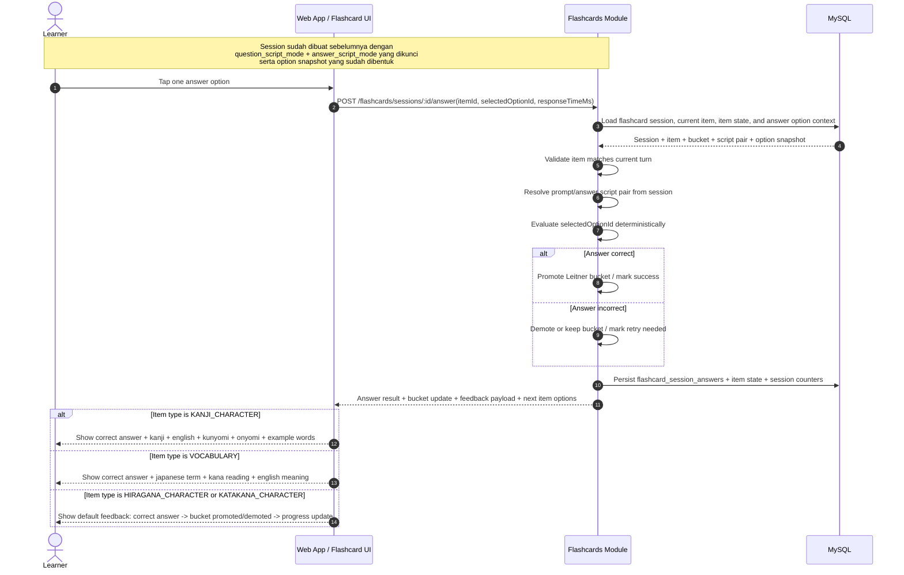

# Flashcard + Answer Evaluation Sequence Diagram

## Scope
- Diagram ini hanya memodelkan flow flashcard sampai hasil jawaban tersimpan di database milik module `flashcards`.
- Flow berhenti sebelum `record learning event` dikirim ke module `progress`.
- Diagram ini fokus ke ownership internal `flashcards` untuk evaluasi jawaban multiple-choice, update session state, dan feedback payload yang akan dikirim balik ke UI.
- Diagram ini mengasumsikan opsi jawaban final sudah dibentuk ketika session dibuat, lalu dipakai sebagai snapshot tetap untuk turn answer selama session aktif.

## Sequence Diagram

## Key Decisions Locked By This Diagram
- `flashcards` tetap menjadi owner untuk evaluasi jawaban flashcard, perubahan Leitner bucket, dan snapshot opsi jawaban yang dipakai untuk grading.
- Opsi jawaban final dibentuk lebih awal saat session dibuat dari canonical answer + distractor pool item, bukan dibangkitkan ulang ketika user menekan submit.
- Session script pair dipilih sebelum session dimulai dan tidak diubah di tengah session aktif.
- Semua hasil evaluasi, opsi yang ditampilkan, dan perubahan bucket disimpan dulu di storage milik `flashcards` sebelum ada handoff ke module lain.
- Handoff ke `progress` sengaja dipisah ke diagram lain agar boundary ownership lebih jelas.

## Expected Outcome
- Satu jawaban flashcard multiple-choice selesai diproses penuh di boundary `flashcards` sampai state internalnya aman tersimpan.
- Setelah titik ini, flow bisa dilanjutkan ke diagram [update-progress-snapshot.md](./update-progress-snapshot.md).
